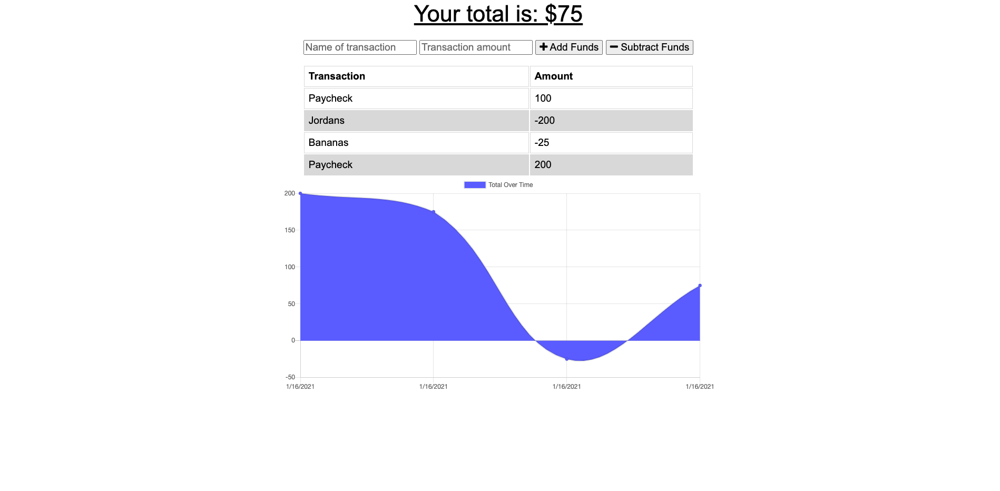

# OnlineOfflineBudgetTracker

David K. Brown's Budget-Tracker

## Table of Contents

- [Description](#description)

- [Screenshots](#screenshots)

- [Acceptance-Criteria](#Acceptance-Criteria)

- [Installation](#installation)

- [Credits](#credits)

- [Contributing](#contributing)

- [Copyright](#copyright)

## Description

The purpose of this app is to allow a user to track their budget. It allows them to enter deposits as well as enter expenses. Along with the ability to add new values they can be entered offline (stored in IndexedDB) and then uploaded to the database once internet service is restored. As the values are added the total and chart update with values.

## Screenshots



## Acceptance-Criteria

```md
AS AN avid traveller I WANT to be able to track my withdrawals and deposits with or without a data/internet connection SO THAT my account balance is accurate when I am traveling
```

## Installation

To access this application you will need to visit my GitHub page and the "Budget-Tracker" repository. After the repository is cloned/forked you can make edits to the application in your repository. Any questions should be directed to [David Brown](mailto:gatech55@gmail.com). The application repository can be found here: [Budget-Tracker](https://github.com/GaTech55/OnlineOfflineBudgetTracker). The Heroku site can be found here: [Budget-Tracker](https://enigmatic-savannah-72885.herokuapp.com/).

## Credits

© 2019 Trilogy Education Services, a 2U, Inc. brand. All Rights Reserved.
[GitLab-18-Homework](https://gt.bootcampcontent.com/GT-Coding-Boot-Camp/gt-inc-fsf-pt-08-2020-u-c/tree/master/18-PWA/02-Homework)

## Contributing

| **Commits** | **Contributor** |

| 10| [GaTech55](https://github.com/GaTech55)|

## Copyright

Copyright (c) 2021 David Brown.
